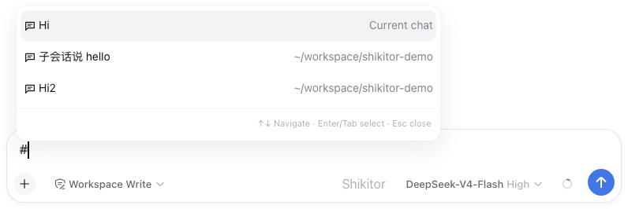
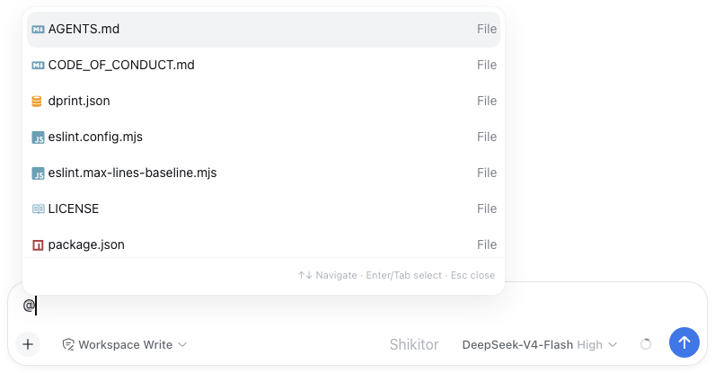
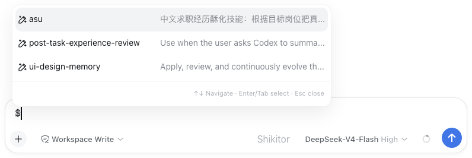
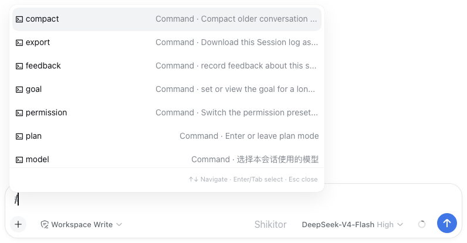
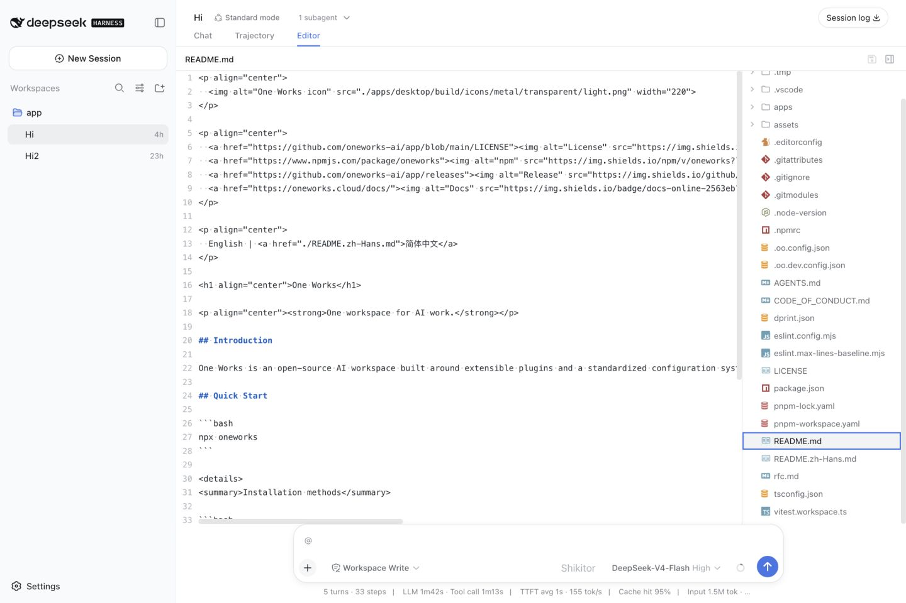
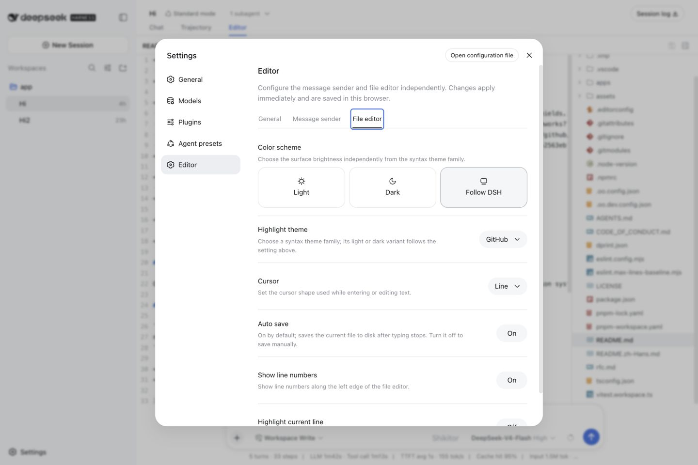

<p align="center">
  
</p>

<h1 align="center">dsh-shikitor</h1>

## Description

A Shikitor editor and sender integration for the DeepSeek Harness web client.

| en-US | [中文](./README.zh-CN.md) |

## Preview

### Discover from the message sender

<table>
  <thead>
    <tr>
      <th width="62%">Preview</th>
      <th>What it discovers</th>
    </tr>
  </thead>
  <tbody>
    <tr>
      <td>
        <picture>
          <source media="(prefers-color-scheme: dark)" srcset="./assets/screenshots/dsh-shikitor-completion-sessions-en-dark.png">
          
        </picture>
      </td>
      <td><strong><code>#</code> Sessions</strong><br>Searches the conversations shown in the current workspace sidebar. A selection is inserted as one protected session link using the <code>deepseekharness://sessions/&lt;sessionId&gt;</code> protocol.</td>
    </tr>
    <tr>
      <td>
        <picture>
          <source media="(prefers-color-scheme: dark)" srcset="./assets/screenshots/dsh-shikitor-completion-files-en-dark.png">
          
        </picture>
      </td>
      <td><strong><code>@</code> Workspace files</strong><br>Lists files from the current workspace. When Cordis plugins or subagents contribute candidates, they appear before files. Files are ordered from shallow to deep, loaded incrementally, and can be narrowed with <code>file:</code> or <code>plugin:</code>. Hidden paths appear only after the query explicitly enters a dot-prefixed segment.</td>
    </tr>
    <tr>
      <td>
        <picture>
          <source media="(prefers-color-scheme: dark)" srcset="./assets/screenshots/dsh-shikitor-completion-skills-en-dark.png">
          
        </picture>
      </td>
      <td><strong><code>$</code> Skills</strong><br>Searches merged project, home, and plugin-provided skills. Project-local entries take precedence when names collide, and the chosen skill is converted to DSH's executable <code>/skill-name</code> form.</td>
    </tr>
    <tr>
      <td>
        <picture>
          <source media="(prefers-color-scheme: dark)" srcset="./assets/screenshots/dsh-shikitor-completion-commands-en-dark.png">
          
        </picture>
      </td>
      <td><strong><code>/</code> Commands</strong><br>Uses DSH's command catalog together with executable skills. Selection remains inside DSH's original pick transaction, so built-in command behavior and plugin contributions continue to work.</td>
    </tr>
  </tbody>
</table>

### Workspace file editor

<picture>
  <source media="(prefers-color-scheme: dark)" srcset="./assets/screenshots/dsh-shikitor-editor-en-dark.png">
  
</picture>

### Editor settings

<picture>
  <source media="(prefers-color-scheme: dark)" srcset="./assets/screenshots/dsh-shikitor-settings-en-dark.png">
  
</picture>

## Features

The integration provides:

- Shikitor editing and completion menus in the DSH message sender;
- a file editor tab for the current workspace;
- a Cordis `ctx.shikitor` service that other client plugins can extend.

Completion menus support pointer selection, Arrow Up/Down, Enter/Tab, and
Escape. Workspace files are ordered from shallow to deep and loaded into the
menu incrementally while scrolling. The Message sender settings can further
limit file search with comma-separated include/exclude folder globs. Accepted
file references render only the filename. Cmd-click
(Ctrl-click on Windows or Linux) opens the referenced workspace file in the
Shikitor editor tab.

Skill discovery covers `<projectRoot>/{.agents,.codex,.claude,.oo}/skills` and
the matching directories under the user's home. Project entries win duplicate
names from home entries.

## Register a surface plugin

```ts
import type { ClientContext } from '@deepseek-ai/dsh-client-runtime/client'
import mySenderPlugin from './my-sender-plugin.ts'

export const inject = ['shikitor']

export function apply(ctx: ClientContext) {
  ctx.effect(
    () => ctx.shikitor.register('sender', mySenderPlugin),
    'my-plugin: Shikitor sender contribution',
  )
}
```

Use `sender` for message-composer behavior and `editor` for file-editor behavior.
Register the same Shikitor plugin on both surfaces when they should share it.

## Register a file icon rule

```ts
export const inject = ['shikitor']

export function apply(ctx: ClientContext) {
  return ctx.shikitor.registerFileIcon({
    extensions: ['vue', 'svelte'],
    icon: 'vue-icon medium-green',
    color: '#41b883',
    priority: 100,
  })
}
```

The default filename mapping, glyphs, fonts, and colors come from
[Atom File Icons](https://github.com/file-icons/atom). Rules can match
`extensions`, exact `fileNames`, or a custom `match` function. Their `icon` may
be an Atom File Icons class list or a DOM renderer. Higher `priority` wins;
equally ranked rules prefer the most recently registered contribution. The
disposer removes only that plugin's rule.

General settings also expose browser-persisted path rules. Each rule accepts a
glob (`*` within one path segment, `**` across folders) and can select any Atom
glyph or an image. Image sources may be HTTP(S)/data URLs, workspace-relative
paths, or absolute paths inside the current workspace. Workspace images must
use a supported image type and be no larger than 1 MiB. Later user rules win.
Plugins can observe the same effective registry through
`fileIconRules`; the editable rules are exposed separately through
`configuredFileIconRules` and `configureFileIconRules()`.

The General settings tab owns the shared color scheme, highlight-theme family,
cursor shape, and file-icon policy. Sender and File editor inherit that
appearance until their first surface-specific change;
`resetSurface()` removes the override and resumes live inheritance. Editor-only
line/current-line controls remain on the File editor tab. These browser-local
appearance values are also available through `ctx.shikitor.appearance`,
`resolveAppearance()`, and `configureAppearance()`.

Edited files save automatically by default. Auto save can be disabled in the File editor settings; the editor toolbar and Cmd/Ctrl+S remain available for manual saves. Plugins can read and update this behavior through `ctx.shikitor.preferences` and `configurePreferences()`.
