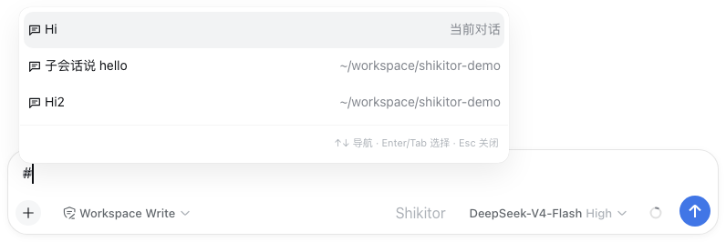
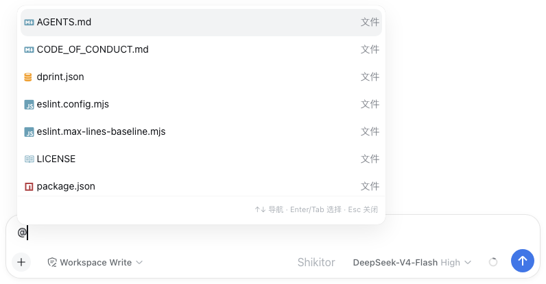
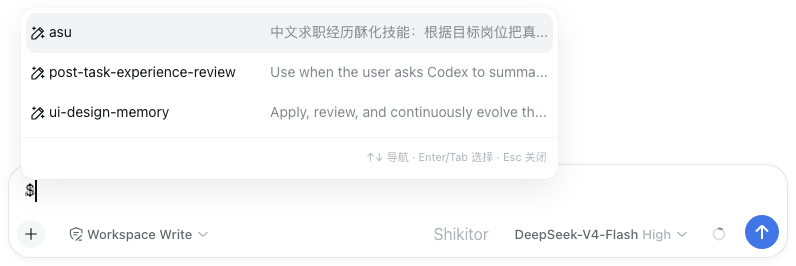
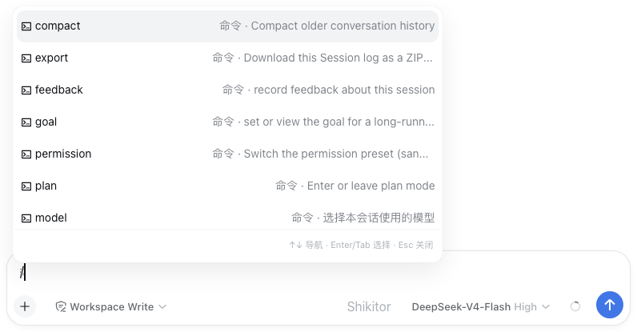
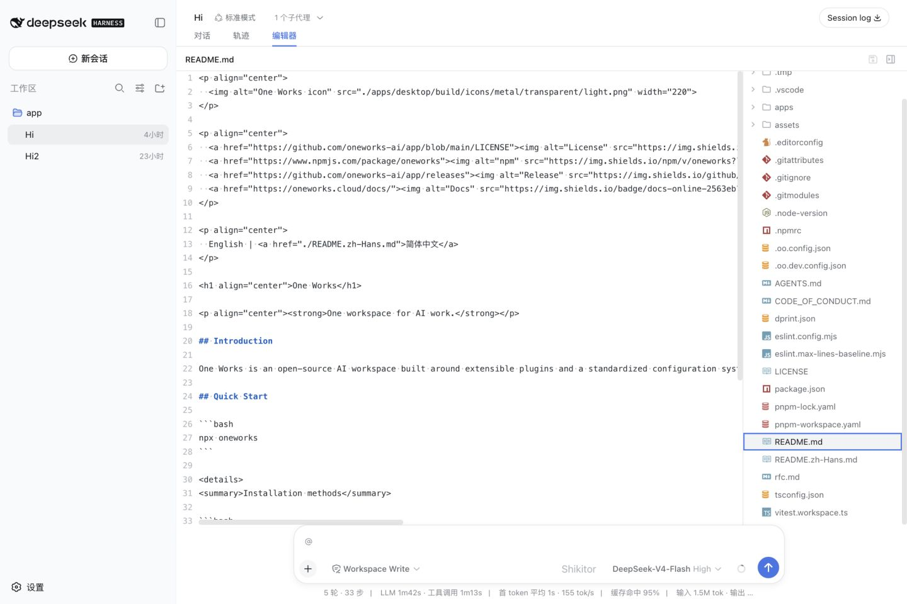
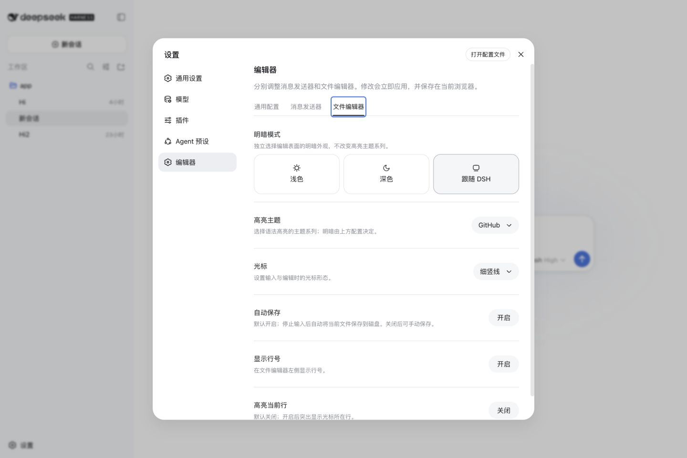

<p align="center">
  
</p>

<h1 align="center">dsh-shikitor</h1>

## 介绍

为 DeepSeek Harness Web 客户端提供 Shikitor 编辑器和消息发送器集成。

| [en-US](./README.md) | 中文 |

## 安装

需要 DeepSeek Harness 0.1.0-rc.5 或更高版本，且属于 0.1 版本线
（`<0.2.0`）。

```bash
dsh plugin --profile web add dsh-shikitor
```

## 预览

### 从消息发送器发现上下文

<table>
  <thead>
    <tr>
      <th width="62%">预览</th>
      <th>功能说明</th>
    </tr>
  </thead>
  <tbody>
    <tr>
      <td>
        <picture>
          <source media="(prefers-color-scheme: dark)" srcset="./assets/screenshots/dsh-shikitor-completion-sessions-zh-dark.png">
          
        </picture>
      </td>
      <td><strong><code>#</code> 会话</strong><br>搜索当前工作区左侧栏中的会话。选择后会作为一个不可拆分编辑的会话链接插入，并使用 <code>deepseekharness://sessions/&lt;sessionId&gt;</code> 协议指向原会话。</td>
    </tr>
    <tr>
      <td>
        <picture>
          <source media="(prefers-color-scheme: dark)" srcset="./assets/screenshots/dsh-shikitor-completion-files-zh-dark.png">
          
        </picture>
      </td>
      <td><strong><code>@</code> 工作区文件</strong><br>展示当前工作区中的文件；当 Cordis 插件或子代理提供候选项时，它们会排在文件之前。文件按照路径从浅到深排列并在滚动时分批加载；可使用 <code>file:</code> 或 <code>plugin:</code> 限定来源。只有查询主动进入点号路径段时才展示隐藏目录和文件。</td>
    </tr>
    <tr>
      <td>
        <picture>
          <source media="(prefers-color-scheme: dark)" srcset="./assets/screenshots/dsh-shikitor-completion-skills-zh-dark.png">
          
        </picture>
      </td>
      <td><strong><code>$</code> Skills</strong><br>搜索项目、Home 目录与插件 Provider 合并后的 Skill。出现同名项时项目级配置优先，选择后会转换为 DSH 可执行的 <code>/skill-name</code> 形式。</td>
    </tr>
    <tr>
      <td>
        <picture>
          <source media="(prefers-color-scheme: dark)" srcset="./assets/screenshots/dsh-shikitor-completion-commands-zh-dark.png">
          
        </picture>
      </td>
      <td><strong><code>/</code> 命令</strong><br>复用 DSH 命令目录并合并可执行 Skill。选择仍回到 DSH 原有的 pick transaction，因此内置命令行为和插件贡献都保持有效。</td>
    </tr>
  </tbody>
</table>

### 工作区文件编辑器

<picture>
  <source media="(prefers-color-scheme: dark)" srcset="./assets/screenshots/dsh-shikitor-editor-zh-dark.png">
  
</picture>

### 编辑器设置

<picture>
  <source media="(prefers-color-scheme: dark)" srcset="./assets/screenshots/dsh-shikitor-settings-zh-dark.png">
  
</picture>

## 功能

这个集成提供：

- DSH 消息发送器中的 Shikitor 编辑与补全菜单；
- 用于当前工作区的文件编辑器标签页；
- 可供其他客户端插件扩展的 Cordis `ctx.shikitor` 服务。

补全菜单支持鼠标选择、方向键上下、Enter/Tab 确认和 Escape 关闭。工作区文件按照路径层级从浅到深排列，并在滚动时分批加载。「消息发送器」设置可以用逗号分隔的包含/排除目录 Glob 进一步限制文件检索。文件引用在编辑界面只展示文件名。按住 Cmd 单击（Windows/Linux 使用 Ctrl）可以在 Shikitor 编辑器标签页中打开对应工作区文件。

Skill 发现覆盖 `<projectRoot>/{.agents,.codex,.claude,.oo}/skills`，以及用户 Home 下对应的目录。项目级同名 Skill 优先于全局 Skill。

## 注册表面插件

```ts
import type {} from 'dsh-shikitor/client'
import type { ClientContext } from '@deepseek-ai/dsh-client-runtime/client'
import mySenderPlugin from './my-sender-plugin.ts'

export const inject = ['shikitor']

export function apply(ctx: ClientContext) {
  ctx.effect(
    () => ctx.shikitor.register('sender', mySenderPlugin),
    'my-plugin: Shikitor sender contribution',
  )
}
```

消息输入行为使用 `sender`，文件编辑行为使用 `editor`。如果两个表面需要共享同一个 Shikitor 插件，可以分别注册同一个插件。

## 注册文件图标规则

```ts
export const inject = ['shikitor']

export function apply(ctx: ClientContext) {
  return ctx.shikitor.registerFileIcon({
    extensions: ['vue', 'svelte'],
    icon: 'vue-icon medium-green',
    color: '#41b883',
    priority: 100,
  })
}
```

默认文件名映射、Glyph、字体和颜色来自 [Atom File Icons](https://github.com/file-icons/atom)。规则可以匹配 `extensions`、精确 `fileNames` 或自定义 `match` 函数。`icon` 可以是 Atom File Icons class 列表，也可以是 DOM Renderer。更高的 `priority` 优先；优先级相同时，后注册的 Contribution 优先。调用 Disposer 只会移除对应插件自己的规则。

通用设置还支持持久化在浏览器中的路径规则。每条规则可以填写 Glob（`*` 匹配单层路径，`**` 跨目录匹配），并选择任意 Atom Glyph 或图片。图片来源可以是 HTTP(S)/data URL、工作区相对路径，或当前工作区内的绝对路径。工作区图片必须使用受支持的图片类型，并且不超过 1 MiB。后添加的用户规则优先。插件可以通过 `fileIconRules` 观察最终生效的 Registry；可编辑规则则通过 `configuredFileIconRules` 和 `configureFileIconRules()` 暴露。

「通用配置」负责共享的明暗模式、高亮主题系列、光标形态和文件图标策略。消息发送器和文件编辑器在没有独立配置时继承通用配置；`resetSurface()` 会移除覆盖并重新启用实时继承。行号与当前行高亮仍只属于文件编辑器。浏览器本地外观也可以通过 `ctx.shikitor.appearance`、`resolveAppearance()` 和 `configureAppearance()` 访问。

编辑后的文件默认自动保存。可以在「文件编辑器」设置中关闭自动保存；关闭后仍可使用编辑器工具栏或 Cmd/Ctrl+S 手动保存。插件可以通过 `ctx.shikitor.preferences` 和 `configurePreferences()` 读取或修改这一行为。
